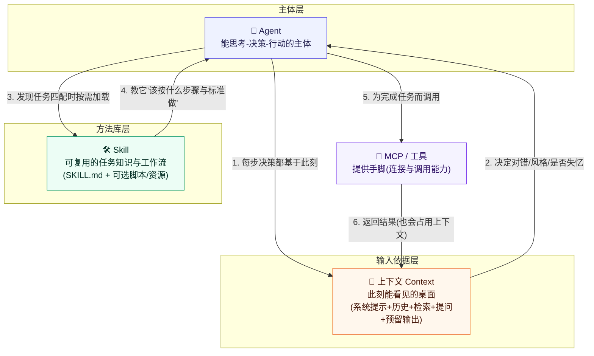

# 三个核心概念的关系：Agent · 上下文（Context）· Skill

> 本文件把 `agent.html`、`llm-context.html`、`skill.html` 三份学习资料串联起来，理清它们在 AI 系统里各自扮演什么角色、如何协作。
> 三者的关系一句话概括：
> **Agent 是"做事的主体"，上下文是"它此刻眼前能看到的桌面"，Skill 是"教会它该怎么把事做规范的可复用菜谱"。**

---

## 1. 三概念对比一览

| 维度 | 🤖 Agent（智能体） | 🧱 上下文 Context | 🛠️ Skill（技能） |
|------|--------------------|-------------------|------------------|
| **一句话定位** | 能自主"思考→决策→行动"完成任务的主体 | 模型某次回答时"能看见的全部 token"（眼前的桌面） | 打包成文件、可复用的"程序性知识/工作流" |
| **回答的问题** | "要完成什么目标、下一步做什么" | "此刻能参考哪些材料" | "这类活该按什么标准、什么步骤做" |
| **本质** | 一个能调用工具、会规划的**执行循环** | 一种**动态的、一次性的输入状态** | 一种**静态的、可长期复用的知识文件** |
| **生命周期** | 持续运行、多轮迭代 | 每次请求结束即清空（用完即弃） | 长期保存，按需被加载 |
| **在系统中的角色** | 主体（actor/agent） | 决策依据（working memory） | 方法库（procedure / recipe） |
| **是否占上下文** | 它生成的内容也会进上下文 | 它就是"上下文本身" | 平时只占 name+description，命中才加载正文 |
| **与"人的能力"类比** | 一位会办事的员工 | 员工此刻眼前摊开的桌面/草稿纸 | 员工随身携带的《标准操作手册》 |
| **典型载体** | 对话会话、Agent 循环、工具调用链 | 系统提示 + 历史 + RAG 资料 + 提问 + 预留输出 | `SKILL.md`（+ scripts/references/assets） |
| **影响输出质量的方式** | 决定"要不要做、做哪一步" | 决定"这次回答对错、风格、是否失忆" | 决定"同类任务是否每次都做得稳定一致" |

> 一句话记忆：**Agent 有脑子会行动，上下文决定它这次"看到"什么，Skill 决定它"按什么规矩"行动。**

---

## 2. 上下文如何影响 Agent 的工作

Agent 和普通聊天机器人最大的不同，是它能自主地在"思考 → 决定调用工具 → 观察结果 → 再思考"的循环里反复推进。而**这个循环里的每一步，都只依赖 Agent 此刻上下文里能看见的内容**——这正是"上下文影响 Agent"的根本机制。

**① 上下文决定 Agent"能看到什么目标与规则"。**
Agent 的目标、角色设定、边界约束通常写在上下文开头的**系统提示**里。上下文里有没有这句话，决定了 Agent 是"尽力完成一个目标"还是"漫无目的地闲聊"。规则放得越清楚，Agent 的自主行为越不跑偏。

**② 上下文决定 Agent"能依据什么事实"做判断。**
当 Agent 要回答或决策时，它靠的不是"想起整个互联网"，而是**上下文里此刻摆着的内容**：用户给的信息、历史对话、通过 RAG 检索来的资料。资料没进上下文，Agent 就只能凭训练知识猜，容易出错或编造；正确资料进了上下文，它的每一步行动才有据可依。

**③ 上下文是 Agent"记忆"的唯一载体——也是最脆弱的环节。**
Agent 没有独立的长期记忆，它"记住"的上一轮结果，其实只是被继续回传的对话历史（仍占着上下文）。一旦上下文窗口被塞满：
- 最早的指令可能被挤出 → Agent "忘了自己最初的目标"，行为漂移；
- 工具调用产生的中间结果不断堆积 → 上下文变臃肿，Agent "抓不住重点"（大海捞针 / context rot），决策质量下降；
- 超长任务里如果不管上下文，Agent 会越跑越"迷失"。

**④ 所以"上下文工程"是驾驭 Agent 的核心能力。**
让 Agent 可靠地干活，不只是把上下文尽量塞满，而是**在有限的窗口里精心管理"放什么、何时放、何时压缩/清理掉什么"**：该精挑的检索资料、该压缩的历史、该清理的旧工具结果，都要主动打理。上下文管得好，Agent 才稳定、专注、不迷失。

> 小结：**上下文是 Agent 的"工作记忆 + 决策依据"，也是它的"失忆风险点"。** 想用好 Agent，本质上是在把上下文这门有限的资源经营好。

---

## 3. Skill 如何沉淀可复用的任务知识

如果每次让 Agent 做某类任务都靠现场手写一大段提示词，会遇到三个问题：**不稳定**（每次发挥不一）、**不省心**（同样的话反复说）、**不复用**（这次的流程没法沉淀下来给下次用）。Skill 正是为解决这些问题而生的——它把"任务知识"变成一份可保存、可加载、可分享的文件。

**① Skill 沉淀的是"程序性知识"，不是"静态知识"。**
模型天生拥有的是"事实与语言能力"（知道 1+1=2、会说中文）；而 **"一个任务该怎么一步步做成、按什么标准验收"这类流程性知识，恰恰是模型不天生具备、每次都要临时给的**。Skill 就把这份"怎么做"的方法论固化下来，存成 `SKILL.md`。

**② Skill 用"标准结构"把知识组织成可复用模块。**
一份规范的 Skill 通常包含：
- 顶部 **YAML 元数据**（`name` + `description`）→ 让 Agent 能识别"这技能何时该用"，相当于技能的"索引标签"；
- **正文工作流** → 把一次性的口头叮嘱，变成固定的步骤序列；
- 可选的 **scripts / references / assets** → 附上代码、规范文档、模板，进一步沉淀细节。

**③ Skill 让知识"一次写入，处处受益"。**
写好一次，同类任务里 Agent 只要通过 `description` 判断命中，就会自动把这份 Skill 的正文加载进上下文、按其流程执行。于是：
- **一致性**：每次输出都遵守同一套标准与顺序；
- **沉淀性**：你在某次任务里总结出的好做法、避过的坑，能写进 Skill 变成长期资产；
- **可审查、可分享**：Skill 就是普通文件，可以像代码一样版本化、给别人复用。

**④ 判断"要不要沉淀成 Skill"的标准很朴素。**
一个很实用的经验法则——**任何你写超过 2 遍的提示词 / 反复走的流程，都值得封装成一个 Skill**。判断依据不是"它多高深"，而是"它是否高频、是否重复、是否值得统一"。

> 小结：**Skill 是把"怎么把某类事做对做稳"的隐性经验，显性化为可复用的文件**——本质是给 Agent 装上一套它可随时翻阅的《标准操作手册》。

---

## 4. 三者关系 Mermaid 图

**图怎么读（协作闭环）：**
1. **Agent 启动后**，它的一切决策都依赖"此刻的上下文"里能看到什么；
2. 上下文质量（放对了什么、别塞爆了）**直接决定 Agent 输出对不对、稳不稳**；
3. 当任务属于"某类可复用的活"，Agent 会**扫描已装 Skill 的描述**、命中后按需把那个 Skill 加载进上下文；
4. 加载进来的 Skill **用固定工作流与标准约束 Agent 的行动**，让同类任务做得一致可靠；
5. 干活时 Agent 需要真本事，就**调用 MCP/工具**去连外部服务、拿数据；
6. 工具返回的结果 **又写回上下文**，供 Agent 下一步思考——闭环继续。

一句话：**Agent 是驾驶员，上下文是它眼前的仪表盘与车窗视野，Skill 是它随身带的《作业指导书》，MCP/工具是它的方向盘和油门。**

---

## 5. 我的理解（个人思考）

学完这三个概念，我自己最有感触的是两件事：

**第一，三者其实是"同一件事的三个不同管理层次"。**
以前我把"怎么让 AI 干好活"简单理解成"提示词写得妙不妙"。现在看，这三个概念帮我把这件事拆成了更清晰的三层：
- **Skill 层**：解决"把会做的事沉淀下来、重复做对"——属于**长期的方法积累**；
- **上下文层**：解决"这次具体怎么做对"——属于**当次的临时决策依据**；
- **Agent 层**：解决"要不要做、下一步做哪个动作"——属于**自主执行的调度**。

这让我意识到，想让 AI 可靠，光靠"写得好"不够，还得靠"**沉淀得好（Skill）+ 喂得准（Context）+ 调度得稳（Agent）**"三件事同时成立。

**第二，对我们这个作业项目来说，这三份概念其实形成了一个很自然的"自举闭环"。**
我亲手创建了 concept-learner 这个 Skill（方法层），又分别用它生成了学 Agent、学上下文、学 Skill 的学习资料。而在这份关系文件里，我看到：**concept-learner 这个 Skill 之所以能让我稳定地产出结构一致的学习资料，正是因为它把"如何做一份个人学习设计"这套流程，固化成了可复用、带自检的 SKILL.md**——这本身就是第 3 节说的"Skill 沉淀可复用任务知识"最直接的例子。

如果再往深想一层：如果将来我想让 Agent 帮我做更多"有章法"的事——比如按固定格式写周报、按规范处理数据——正确的做法不是每次现场交代，而是**先沉淀一个 Skill，把它教会**。这才是把 AI 从"偶尔靠谱的工具"变成"稳定可依赖的同事"的关键。

> 一句话收尾：**Skill 让你把经验留下，上下文让你把当下看清楚，Agent 让你把事干完——三者缺一，都成不了可靠的 AI 生产力。**
